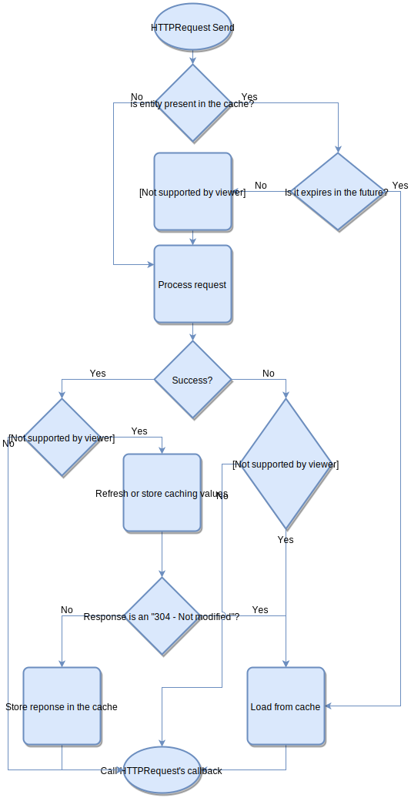

Caching works automatically and without any further setup. The plugin handles the caching headers received from the server in the response and adds additional headers to the request to check the cached content's freshness. 

## Headers

Caching uses the following headers:

- [ETag](https://developer.mozilla.org/en-US/docs/Web/HTTP/Headers/ETag): When present for a cached entity, the plugin will send out an `If-None-Match` header with the following request to test the stored entity's freshness. If the server returns with an *304 - Not Modified*, the plugin loads the content from the local cache.
- [Last-Modified](https://developer.mozilla.org/en-US/docs/Web/HTTP/Headers/Last-Modified): All operations is the same as with the ETag header, but it will send out an `If-Modified-Since` header.
- [Expires](https://developer.mozilla.org/en-US/docs/Web/HTTP/Headers/Expires): When present for a cached entity and its value is in the future, the plugin loads content from the cache without contacting the server to validate the entity's freshness. When present all previous headers are ignored.
- [Cache-Control](https://developer.mozilla.org/en-US/docs/Web/HTTP/Headers/Cache-Control): When present with the max-age option and the entity's calculated age is less then its max-age, the plugin loads the content from the cache the same way as with the Expires. When present all previous headers are ignored.

Flow-chart about caching:



## Disable caching

There's quite a few ways to disable caching. It can be done globally with the [BESTHTTP_DISABLE_CACHING](../../7.GlobalTopics/HowToDisableFeatures.md) define or by setting [HTTPManager.IsCachingDisabled](../../7.GlobalTopics/GlobalSettings.md) to true before any HTTPRequest instantiation:
```language-csharp
HTTPManager.IsCachingDisabled = true;
```

It can be disabled per-request by setting the HTTPRequest's DisableCache property to true:
```language-csharp
var request = new HTTPRequest(new Uri("..."), ImageDownloaded);
request.DisableCache = true;
request.Send();
```

## Caching related properties

<u>HTTPRequest</u>:

- **DisableCache**: With this property caching can be enabled/disabled on a per-request basis.
- **CacheOnly**: It can be used with [streaming](DownloadStreaming.md). When set to true, no `OnStreamingData` event is called, the streamed content will be saved straight to the cache if all requirements are met(caching is enabled and there's a caching headers).

<u>HTTPResponse</u>:

- **IsFromCache**: Indicates that the response body is read from the cache.
- **CacheFileInfo**: Provides information about the file used for caching the request.
- **IsCacheOnly**: Determines if this response is only stored to cache. If both `IsCacheOnly` and `IsStreamed` are true, `OnStreamingData` isn't called.

## Maintainence

Although caching is automatic we have some control over it, or we can gain some info using the public functions of the `HTTPCacheService` class:

- **BeginClear()**: It will start clearing the entire cache on a separate thread.
- **BeginMaintainence()**: With this function’s help, we can delete cached entries based on the last access time. It deletes entries that’s last access time is older than the specified time. We can also use this function to keep the cache size under control:

```language-csharp
// Delete cache entries that weren’t accessed in the last two weeks, then
// delete entries to keep the size of the cache under 50 megabytes, starting with the oldest.
HTTPCacheService.BeginMaintainence(new HTTPCacheMaintananceParams(TimeSpan.FromDays(14), 50 * 1024 * 1024));
```


- **GetCacheSize()**: Will return the size of the cache in bytes.
- **GetCacheEntryCount()**: Will return the number of the entries stored in the cache. The average cache entry size can be computed with the `float avgSize = GetCacheSize() / (float) GetCacheEntryCount()` formula.

- **IsDoingMaintainence**: Its value is `true` while the cache service doing any Clear or Maintainence on a separate thread.