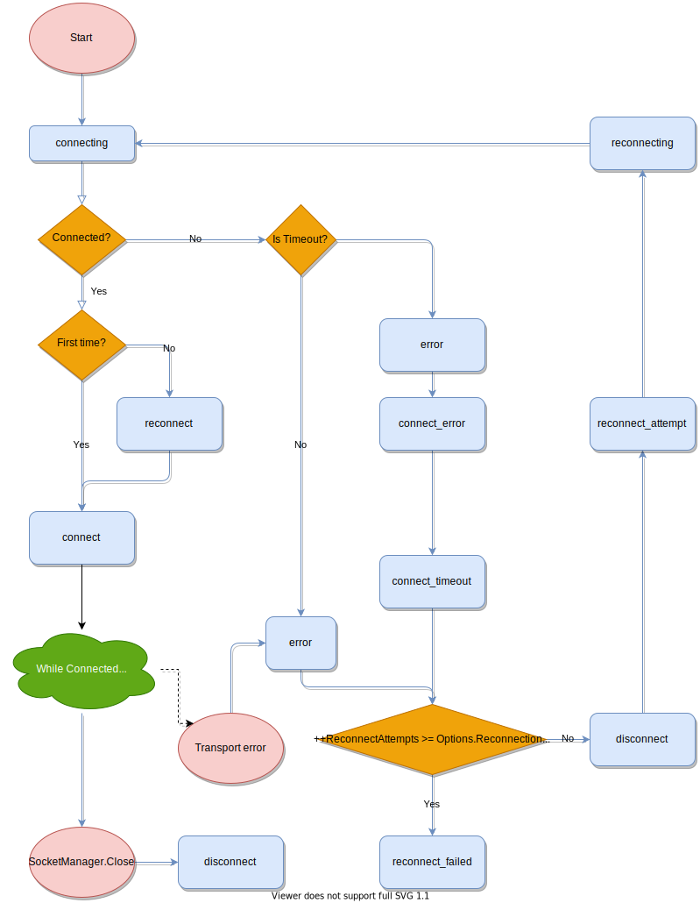
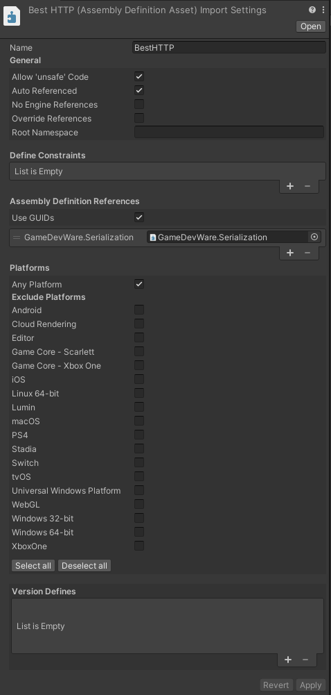

# Socket.IO 3
Changes made in Socket.IO v3 (and Engine.IO v4) enables a less complex parser and message sending logic. To make the plugin's Socket.IO implementation a more user-friendly API with strongly typed callbacks, keeping backward compatibility became unaccomplishable. Breaking the backward compatibility however enabled to add even more features like volatile emits and new parsers.

The old implementation is still available in the package, but with Socket.IO 3, i recommend to use classes from the new *BestHTTP.SocketIO3* namespace.

## Connecting to a Socket.IO service

First step to connect to a Socket.IO server is to create a SocketManager instance:

```language-csharp
using BestHTTP.SocketIO3;

var manager = new SocketManager(new Uri("http://localhost:3000"));
```

The official Socket.IO server implementation [binds to the /socket.io/](https://socket.io/docs/v3/server-initialization/#path) path, and the client going to append it to the uri if the uri's path part isn't present.

By default SocketManager going to start to connect to the server as soon as a namespace is accessed through its `Socket` property or `GetSocket` function:

```language-csharp
using BestHTTP.SocketIO3;

var manager = new SocketManager(new Uri("http://localhost:3000"));

// Accessing the root ("/") socket
var root = manager.Socket;

// or calling GetSocket triggers the connection procedure.
var customNamespace = manager.GetSocket("/my_namespace");

// At this point the manager already started to connect to the server
```

This auto connection can be disabled through a `SocketOptions` instance:

```language-csharp
using BestHTTP.SocketIO3;

SocketOptions options = new SocketOptions();
options.AutoConnect = false;

var manager = new SocketManager(new Uri("http://localhost:3000"), options);

var root = manager.Socket;
var customNamespace = manager.GetSocket("/my_namespace");

// AutoConnect is turned off, Open must be called
manager.Open();
```

This way the SocketManager going to start to connect to the server when its Open function is called.

`Open` and connection to the server in general is non-blocking, the function returns immediately and messages are sent only after the `connect` event.

!!! Notice
	Don't forget that the new implementation is under the `BestHTTP.SocketIO3` namespace!
	
## Socket IDs

As of Socket.IO 3 the connection has an ID and all namespaces (sockets) has a different one too. The connection's ID can be accessed through the `SocketManager`’s `Handshake` property:

```language-csharp
var manager = new SocketManager(new Uri("http://localhost:3000"));
manager.Socket.On("connect", () => Debug.Log(manager.Handshake.Sid));
```

Per-socket ID is received when the socket is connected, can be accessed through the connect event as a parameter, or later through the socket instance:
```language-csharp
manager = new SocketManager(new Uri("http://localhost:3000"), options);
manager.Socket.On<ConnectResponse>(SocketIOEventTypes.Connect, OnConnected);

void OnConnected(ConnectResponse resp)
{
    // Method 1: received as parameter
    Debug.Log("Sid through parameter: " + resp.sid);

    // Method 2: access through the socket
    Debug.Log("Sid through socket: " + manager.Socket.Id);
}
```

`ConnectResponse`'s `sid` and `Socket`'s `Id` is the same value.

!!! Notice
	`ConnectResponse` can be found in the *BestHTTP.SocketIO3.Events* namespace.

## Disconnecting

`SocketManager`'s `Close` function closes all sockets, shuts down the transport and no more communication is done to the server. Calling `Disconnect` on a socket disconnects only that socket, communication through other sockets are still possible. Disconnecting the last socket closes the SocketManager too.

## Subscribing to events

Subscribing to Socket.IO events can be done through the `On` and `Once` functions. There's also an `ExpectAcknowledgement` function that can be used to define a callbacks that going to be called when [the server executes a callback function](https://socket.io/docs/v3/emitting-events/#Acknowledgements).

### Parameterless events

All functions to subscribe to events support parameterless events. These events aren't expects any parameters from the servers:

```language-csharp
manager.Socket.On("connect", () => Debug.Log("connected!"));
```

### Strongly typed events

Both `On` and `Once` can accept numerous type parameters and tries to parse the received event to match these types. For example the following call on the server:
```language-csharp
socket.emit('message', 0, 1);
```

Thi event can be caught with the followin subscription on the client:
```language-csharp
manager.Socket.On<int, int>("message", (arg1, arg2) => Debug.Log($"{arg1}, {arg2}"));
```
Here we subscribe to the event called `"message"`, expecting two `int` parameters.

Complex objects can be sent and subscribed to (Server):
```language-csharp
socket.emit("user-info", {
    users: ["User 1", "User 2"],
    buff: Buffer.from([9, 8, 7, 6, 5, 4, 3, 2, 1])
});
```

(Client:)
```language-csharp
class UserInfo
{
    public string[] users;
    public byte[] buff;
}

manager.Socket.On<UserInfo>("user-info", OnUserInfo);

private void OnUserInfo(UserInfo userInfo)
{
    Debug.Log($"user-info: {string.Join(",", userInfo.users)}, buff: {userInfo.buff.Length}");
}
```

By default any additional fields that present in the receiving type that has no corresponding field in the json going to be initialized to its default value. 

Binary data can be sent alone too (Server):
```language-csharp
socket.emit('binary', Buffer.from([9, 8, 7, 6, 5, 4, 3, 2, 1]));
```

(Client:)
```language-csharp
manager.Socket.On<byte[]>("binary", OnBinaryMessage);

private void OnBinaryMessage(byte[] buffer)
{
    Debug.Log("OnBinaryMessage: " + buffer.Length);
}
```

### Inject SocketManager and Socket as callback parameters

While the client parse the parameters it can inject the `SocketManager` or the receiving `Socket` instance (Server) into the parameter list:

```language-csharp
socket.emit('binary', Buffer.from([9, 8, 7, 6, 5, 4, 3, 2, 1]));
```

(Client:)
```language-csharp
manager.Socket.On<SocketManager, Socket, byte[]>("binary", OnBinaryMessage);

private void OnBinaryMessage(SocketManager manager, Socket socket, byte[] buffer)
{
    Debug.Log("OnBinaryMessage: " + buffer.Length);
}
```

### Acknowledgements

With `ExpectAcknowledgement` we can set a callback that's going to be called (Client):
```language-csharp
class ReturnVal
{
    public int code;
    public string msg;
}

manager.Socket.ExpectAcknowledgement<ReturnVal>(OnAcknowledgements).Emit("chat message", "msg 1");

private void OnAcknowledgements(ReturnVal value)
{
    Debug.Log($"{value.code}, '{value.msg}'");
}
```

(Server:)
```language-csharp
socket.on('chat message', (msg, ack_callback) => {
    ack_callback({ code: 102, msg: 'ok ' + msg });
});
```

### Special Events

`connect` and `error` events are special as their type parameters are already defined. `connect` emits a `ConnectResponse` object that have only one field `sid`:

```language-csharp
manager.Socket.On<ConnectResponse>(SocketIOEventTypes.Connect, OnConnected);

void OnConnected(ConnectResponse resp)
{
	Debug.Log("Connected sid: " + resp.sid);
}
```

Specifying a different type parameter for connect will produce an error.

On the other hand, while `error` has a predefined `Error` type with a `message` property a new, custom error type can be created and used.

For example a server side middleware might want to send additional data other than just a plain text:

```language-csharp
io.use((socket, next) => {
    const err = new Error("not authorized");
    err.data = { content: "Please retry later", code: 101 };
    next(err);
});
```

```language-csharp
class ErrorData
{
    public int code;
    public string content;
}

// Error already defines the message property
class CustomError : Error
{
    public ErrorData data;

    public override string ToString()
    {
        return $"[CustomError {message}, {data?.code}, {data?.content}]";
    }
}

manager.Socket.On<CustomError>(SocketIOEventTypes.Error, OnError);

void OnError(CustomError args)
{
    Debug.LogError(string.Format("Error: {0}", args.ToString()));
}
```

## Sending Events

Sending an event can be done with the `Emit` function:

```language-csharp
manager.Socket.Emit("chat message", "msg 1");
```

Its first parameter is the name of the event, followed by any number of parameters.

### Volatile Events

A [volatile event](https://socket.io/docs/v3/emitting-events/#Volatile-events) isn't sent when the client can't send it right there. When no transport is ready to send a volatile event, instead of buffereing to send it later it's going to be discarded. An event can be marked as volatile by calling `Volatile()` on the socket first:

```language-csharp
manager.Socket.Volatile().Emit("chat message", "msg");
```

## Namespaces

`SocketManager`'s `Socket` property is bound to the root ('/') namespace. Every subscription and event sent through this is sent to the root namespace. New namespaces can be accesses and connected to through the `GetSocket` function:
```language-csharp
manager.GetSocket("/customNamespace").On(SocketIOEventTypes.Connect, OnNameSpaceConnected);
```

## Rooms

Rooms are completely server-side features, no client support required!

## Options

You can pass a SocketOptions instance to the SocketManager’s constructor. You can change the following options:

- **AdditionalQueryParams**: Additional query parameters that will be passed for accessed uris. If the value is null, or an empty string it will be not appended to the query only the key. *The keys and values must be escaped properly, as the plugin will not escape these.*

```language-csharp
SocketOptions options = new SocketOptions();
options.AdditionalQueryParams = new PlatformSupport.Collections.ObjectModel.ObservableDictionary<string, string>();
options.AdditionalQueryParams.Add("token", "< token value >");

var manager = new SocketManager(new Uri("http://localhost:3000"), options);
```

- **Reconnection**: Whether to reconnect automatically after a disconnect. Its default value is true.
- **ReconnectionAttempts**: Number of attempts before giving up. Its default value is Int.MaxValue.
- **ReconnectionDelay**: How long to initially wait before attempting a new reconnection. Affected by +/- RandomizationFactor. For example the default initial delay will be between 500ms to 1500ms. Its default value is 1000ms.
- **ReconnectionDelayMax**: Maximum amount of time to wait between reconnections. Each attempt increases the reconnection delay along with a randomization as above. Its default value is 5000ms.
- **RandomizationFactor**: It can be used to control the ReconnectionDelay range. Its default value is 0.5 and can be set between the 0..1 values inclusive.
- **Timeout**: Connection timeout before a "connect_error" and "connect_timeout" events are emitted. It’s not the underlying tcp socket’s connection timeout, it’s for the socket.io protocol. Its default value is is 20000ms.
- **AutoConnect**: By setting this false, you have to call SocketManager's Open() whenever you decide it's appropriate.
- **ConnectWith**: The SocketManager will try to connect with the transport set to this property. It can be TransportTypes.Polling or TransportTypes.WebSocket.
- **HTTPRequestCustomizationCallback**: A callback that called for every `HTTPRequest` the socket.io protocol sends out. It can be used to further customize (add additional headers for example) requests. This callback is called for Websocket upgrade requests too on non-WebGL platforms.
- **Auth**: Connecting to a namespace a client can send payload data. When the Auth callback function is set, the plugin going to call it when connecting to a namespace. Its return value going to be serialized by the Parser.

When you create a new SocketOptions object its properties are set to theirs default values.

```language-csharp
SocketOptions options = new SocketOptions();
options.Auth = (manager, socket) => new { token = "<token>" };

var manager = new SocketManager(new Uri("http://localhost:3000"), options);
```

## Reconnection

When there's a timeout or the transport disconnects from the server unintentionally the SocketOptions' Reconnection is true, the manager tries to reconnect to the server. Reconnect logic can be modified through SocketOptions.

## Emitted events

All light blue rounded rectangles int this flow chart can be subscribed to:

 
 
As described above `connect` and `error` are special events witch means they have parameters. Other emitted events have no parameters (other than the possibility of injecting `SocketManager` and `Socket` instances):

```language-csharp
manager.Socket.On("connecting", () => Debug.Log("connecting"));
manager.Socket.On("reconnect", () => Debug.Log("reconnect"));
manager.Socket.On("reconnecting", () => Debug.Log("reconnecting"));
// ...
```
 
## Parsers

By default the SocketManager uses a JSon parser and LitJson to encode/decode objects. It's also capable to send and receive MsgPack encoded messages if the server uses [socket.io-msgpack-parser](https://github.com/darrachequesne/socket.io-msgpack-parser).

To enable and use it, follow these steps:

1. Download and import the [Json & MessagePack Serialization](https://assetstore.unity.com/packages/tools/network/json-messagepack-serialization-59918?aid=1101lfX8E) package
2. Create a new [Asembly Definition file](https://docs.unity3d.com/Manual/ScriptCompilationAssemblyDefinitionFiles.html) under the *Plugins\GameDevWare.Serialization* folder
3. Locate the BestHTTP.asmdef file under the *Best HTTP* folder
4. Reference the newly create asmdef file and press Apply:

	
	
5. Add the **BESTHTTP_SOCKETIO_ENABLE_GAMEDEVWARE_MESSAGEPACK** define to the [Scripting Define Symbols](https://docs.unity3d.com/Manual/PlatformDependentCompilation.html) input under **PlayerSettings/Other Settings**:

	
	
6. Use the now available `MsgPackParser` class:
```language-csharp
var manager = new SocketManager(new Uri("http://localhost:3000"));
manager.Parser = new MsgPackParser();
```

The `MsgPackParser` class can be found in the `Best HTTP\Examples\Socket.IO3\Parsers\` folder.