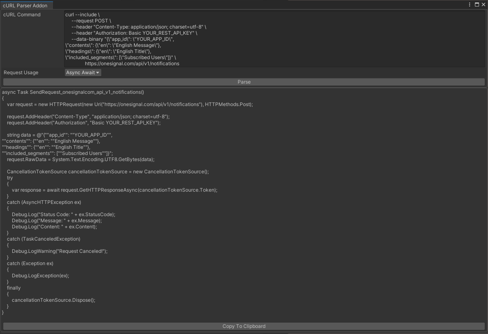

<link href="../TLSSecurity/media/circles.css" rel="stylesheet" />

# About

cURLParser is a tool to help translate cURL commands into Best HTTP/2 code.

## Setup Guide

This addon doesn't require any installation steps, but it's recommended to import after the Best HTTP/2 package. After importing both packages the cURLParser window can be opened through the *Window/Best HTTP/Addons/cURL Parser/Parser Window* menu item or with the Ctrl+Alt+R keyboard shortcut.

## The cURL Parser Window

<div class="circles" >
	
	
	<a href="#window_1"><div class="circle-with-text" style="top:5%;left:37%">1</div></a>
	<a href="#window_2"><div class="circle-with-text" style="top:21%;left:22%">2</div></a>
	<a href="#window_3"><div class="circle-with-text" style="top:24%;left:55.5%">3</div></a>
	<a href="#window_4"><div class="circle-with-text" style="top:56.5%;left:55%">4</div></a>
	<a href="#window_5"><div class="circle-with-text" style="top:96%;left:55.5%">5</div></a>
</div>

1.  <p id="window_1">**cURL Command**: Paste your cURL command here.
1.  <p id="window_2">**Request Usage**: How and where you want to use the generated code. It can generate code to call a callback upon finishing the request, generate a coroutine or an awaitable async function.
1.  <p id="window_3">**Parse Button**: Press this button to parse the command and generate the plugin code.
1.  <p id="window_4">**Generated Code**: This is where the generated code shows up. Note that the generated code is just a snippet, it wouldn't compile pasting it into an empty file and you still have to make edits on the code.
1.  <p id="window_5">**Copy to Clipboard Button**: Clicking on this going to copy the generated code to the clipboard.

!!! Notice
	Not all cURL features and flags have an equivalent one with Best HTTP/2.
	Not all cURL features are parsed and implemented. One example is the file content operator (@) that cURL uses to read a field or other content from a file instead of treating it as a plain textual data.

## Example

The picture above uses a cURL command copied from the [OneSignal REST API documentation](https://documentation.onesignal.com/reference/create-notification#send-to-a-specific-segment-or-all-subscribers---create-notification):

`
curl --include \
     --request POST \
     --header "Content-Type: application/json; charset=utf-8" \
     --header "Authorization: Basic YOUR_REST_API_KEY" \
     --data-binary "{\"app_id\": \"YOUR_APP_ID\",
\"contents\": {\"en\": \"English Message\"},
\"headings\": {\"en\": \"English Title\"},
\"included_segments\": [\"Subscribed Users\"]}" \
     https://onesignal.com/api/v1/notifications
`

And the addon generates the following code:
```language-csharp
async Task SendRequest_onesignalcom_api_v1_notifications()
{
    var request = new HTTPRequest(new Uri("https://onesignal.com/api/v1/notifications"), HTTPMethods.Post);

    request.AddHeader("Content-Type", "application/json; charset=utf-8");
    request.AddHeader("Authorization", "Basic YOUR_REST_API_KEY");

    string data = @"{""app_id"": ""YOUR_APP_ID"",
""contents"": {""en"": ""English Message""},
""headings"": {""en"": ""English Title""},
""included_segments"": [""Subscribed Users""]}";
    request.RawData = System.Text.Encoding.UTF8.GetBytes(data);

    CancellationTokenSource cancellationTokenSource = new CancellationTokenSource();
    try
    {
        var response = await request.GetHTTPResponseAsync(cancellationTokenSource.Token);
    }
    catch (AsyncHTTPException ex)
    {
        Debug.Log("Status Code: " + ex.StatusCode);
        Debug.Log("Message: " + ex.Message);
        Debug.Log("Content: " + ex.Content);
    }
    catch (TaskCanceledException)
    {
        Debug.LogWarning("Request Canceled!");
    }
    catch (Exception ex)
    {
        Debug.LogException(ex);
    }
    finally
    {
        cancellationTokenSource.Dispose();
    }
}
```

