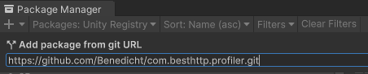
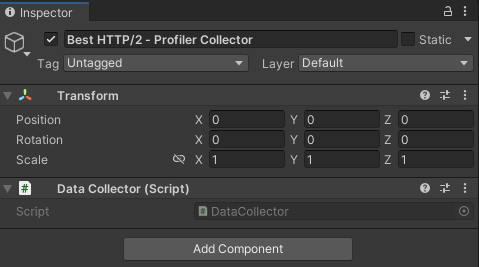
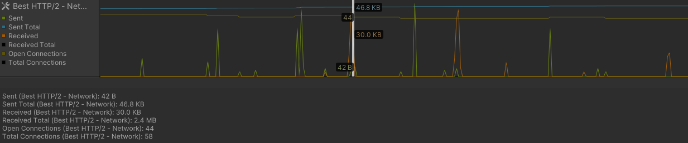
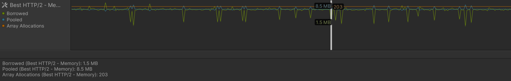

Get and view internal statistics related to the Best HTTP/2 plugin, integrated into the Unity Profiler window.

## Installation

Steps to install and setup:

0. The profiler addon has a dependency on the [com.unity.profiling.core](https://docs.unity3d.com/Packages/com.unity.profiling.core@1.0/manual/index.html) that **requires Unity 2020.1 or newer** installations.
1. Make sure that the [Best HTTP/2](https://assetstore.unity.com/packages/tools/network/best-http-2-155981?aid=1101lfX8E) package is already installed.

2. Using the [Package Manager window](https://docs.unity3d.com/Manual/upm-ui.html) install the package from the following git source: [https://github.com/Benedicht/com.besthttp.profiler.git](https://github.com/Benedicht/com.besthttp.profiler.git):

	

3. Create a new GameObject in your scene and add the DataCollector component:

	



## Network Profiler

Collected fields:

* **Sent**: Sent bytes since the previous frame.
* **Sent Total**: Total bytes sent by the plugin.
* **Received**: Received bytes since the previous frame.
* **Received Total**: Total bytes received.
* **Open Connections**: Currently open connections. An open connection might be an idle connection that have no active request/response to process.
* **Total Connections**: Total connections, including open ones too.



## Memory Profiler

Collected fields:

* **Borrowed**: Borrowed memory from the [BufferPool](../../global_topics/BufferPool.html).
* **Pooled**: Memory in the [BufferPool](../../global_topics/BufferPool.html) available to borrow.
* **Array Allocations**: Total number of `byte[]` allocations through the [BufferPool](../../global_topics/BufferPool.html). An allocation occurs when there's no suitable `byte[]` in the pool to borrow. If it's constantly growing, increasing [BufferPool.MaxPoolSize](../../global_topics/BufferPool.html#maxpoolsize) might be a good idea.



## Data Collection

There are two ways to collect data for the profiler. The first one is to use the `DataCollector` component attached to a GameObject. 
The seconds method is to use the `ProfilerUpdater` directly from code. `ProfilerUpdater.Attach()` can be used to start collecting, its best place is somewhere in a startup code before any other plugin releated calls. `ProfilerUpdater.Detach()` can be used to stop data collection.