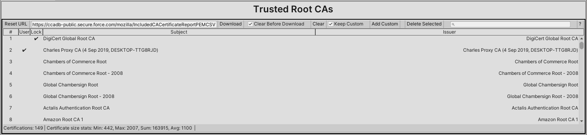
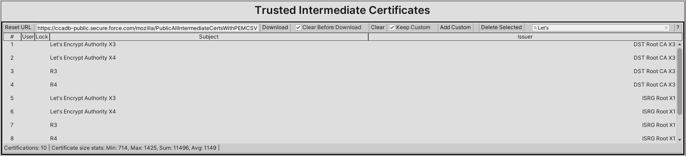
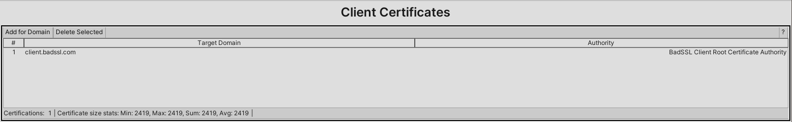
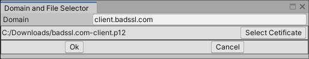
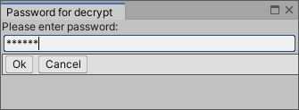
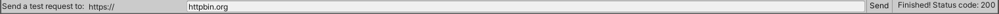

<link href="media/circles.css" rel="stylesheet" />

## Certification Manager Window

The *Window/Best HTTP/Addons/TLS Security/Certification Window* menu item (or CTRL+ALT+E shortcut) opens the addon's Certification Manager. Using this window certificates can be added, updated and deleted.

	
	
	<a href="#trusted-root-cas">
1
</a>
	<a href="#trusted-intermediate-certificates">
2
</a>
	<a href="#client-certificates">
3
</a>
	<a href="#testing-http-requests">
4
</a>
	<a href="#bottom-toolbar">
5
</a>

## Trusted Root CAs

These are the basis of the trust chain, servers doesn't send root certificates the client must include the roots certificates of the accessed endpoints.

	
	
	<a href="#root_1">
1
</a>
	<a href="#root_2">
2
</a>
	<a href="#root_3">
3
</a>
	<a href="#root_4">
4
</a>
	<a href="#root_5">
5
</a>
	<a href="#root_6">
6
</a>
	<a href="#root_7">
7
</a>
	<a href="#root_8">
8
</a>
	<a href="#root_9">
9
</a>
	<a href="#root_10">
10
</a>
	
	<a href="#root_11">
11
</a>
	<a href="#root_12">
12
</a>
	<a href="#root_13">
13
</a>
	<a href="#root_14">
14
</a>
	<a href="#root_15">
15
</a>
	
	<a href="#root_16">
16
</a>
	<a href="#root_17">
17
</a>
	<a href="#root_18">
18
</a>

1.  
**Reset URL**: Reset the URL input back to its addon supplied url.

2.  
**URL Input**: The URL that the addon going to download the certifications. The addon expects CSV formatted data, but the URL can point to a local file using the file:// protocol. The default URLs are pointing to Mozilla repositories.

3.  
**Download**: Clicking on this button start the downloading, content parsing and loading process. Downloading the certificates already uses all verification implemented in the addon.

4.  
**Clear Before Download**: Check to remove all non-locked and non-user added (if `Keep Custom` is checked) certificates before download.

5.  
**Clear**: Remove all non-locked and non-user added (if `Keep Custom` is checked) certificates.

6.  
**Keep Custom**: If set Clear buttons doesn't remove user added certificates.

7.  
**Add Custom**: Add certificates from .cer, .pem and .p7b files.

8.  
**Delete Selected**: Delete selected certificates. Locked certificates can't be deleted!

9.  
**Search Input**: It can be used to search certificates by their `Subject` name. Minimum 3 characters needed.

10. 
**Help (?) Button**: Opens a browser window to this manual.

11. 
**# Column**: Index of the certificate.

12. 
**User Column**: It has a ✔, if it's a user-added certificate.

13. 
**Lock Column**: It has a ✔, if it's locked and can't be deleted. Currently only certificates needed to update from the default URL are locked.

14. 
**Subject Column**: Subject field of the certificate.

15. 
**Issuer Column**: Issuer field of the certificate.

16. 
**Certifications**: Number of certifications displayed.

17. 
**Certificate Size Stats**: Min, max, sum and average size of certificate data in bytes. This can help adjusting cache sizes.

18. 
**Status**: Status of the last operation.



## Trusted Intermediate Certificates

Because servers can choose to not send intermediate certificates it's a good practice to bundle them too.

	
	
	<a href="#intermediate_1">
1
</a>
	<a href="#intermediate_2">
2
</a>
	<a href="#intermediate_3">
3
</a>
	<a href="#intermediate_4">
4
</a>
	<a href="#intermediate_5">
5
</a>
	<a href="#intermediate_6">
6
</a>
	<a href="#intermediate_7">
7
</a>
	<a href="#intermediate_8">
8
</a>
	<a href="#intermediate_9">
9
</a>
	<a href="#intermediate_10">
10
</a>	
	<a href="#intermediate_11">
11
</a>
	<a href="#intermediate_12">
12
</a>
	<a href="#intermediate_13">
13
</a>
	<a href="#intermediate_14">
14
</a>
	<a href="#intermediate_15">
15
</a>	
	<a href="#intermediate_16">
16
</a>
	<a href="#intermediate_17">
17
</a>
	<a href="#intermediate_18">
18
</a>

1.  
**Reset URL**: Reset the URL input back to its addon supplied url.

2.  
**URL Input**: The URL that the addon going to download the certifications. The addon expects CSV formatted data, but the URL can point to a local file using the file:// protocol. The default URLs are pointing to Mozilla repositories.

3.  
**Download**: Clicking on this button start the downloading, content parsing and loading process. Downloading the certificates already uses all verification implemented in the addon.

4.  
**Clear Before Download**: Check to remove all non-locked and non-user added (if `Keep Custom` is checked) certificates before download.

5.  
**Clear**: Remove all non-locked and non-user added (if `Keep Custom` is checked) certificates.

6.  
**Keep Custom**: If set Clear buttons doesn't remove user added certificates.

7.  
**Add Custom**: Add certificates from .cer, .pem and .p7b files.

8.  
**Delete Selected**: Delete selected certificates. Locked certificates can't be deleted!

9.  
**Search Input**: It can be used to search certificates by their `Subject` name. Minimum 3 characters needed.

10. 
**Help (?) Button**: Opens a browser window to this manual.

11. 
**# Column**: Index of the certificate.

12. 
**User Column**: It has a ✔, if it's a user-added certificate.

13. 
**Lock Column**: It has a ✔, if it's locked and can't be deleted. Currently only certificates needed to update from the default URL are locked.

14. 
**Subject Column**: Subject field of the certificate.

15. 
**Issuer Column**: Issuer field of the certificate.

16. 
**Certifications**: Number of certifications displayed.

17. 
**Certificate Size Stats**: Min, max, sum and average size of certificate data in bytes. This can help adjusting cache sizes.

18. 
**Status**: Status of the last operation.



## Client Certificates

A client certificate can be associated with a domain. If the server asks for a client certificate during the TLS handshake, the client going to send it back.

	
	
	<a href="#client_1">
1
</a>
	<a href="#client_2">
2
</a>
	<a href="#client_3">
3
</a>
	
	<a href="#client_4">
4
</a>
	<a href="#client_5">
5
</a>
	<a href="#client_6">
6
</a>
	
	<a href="#client_7">
7
</a>
	<a href="#client_8">
8
</a>

1. 
**Add for domain**: Clicking on it a `Domain and File Selector` window is shown. If the domain is filled and the certification file is selected clicking on the *Ok* button going to add the certification for the domain.

2. 
**Delete Selected**: Delete selected domain-certificate associations.

3. 
**Help (?) Button**: Opens a browser window to this manual.

4. 
**# Column**: Index of the certificate

5. 
**Target Domain Column**: The certificate sent only if it's requested for the target domain.

6. 
**Authority Column**: *Common Name* or *Organizational Unit Name* from the certificate's Issuer field.

7. 
**Certifications**: Number of certifications displayed.

8. 
**Certificate Size Stats**: Min, max, sum and average size of certificate data in bytes. This can help adjusting cache sizes.

Clicking on the `Add for domain` button a new window opens to select the certification file and domain:

Then, clicking on the *Ok* button depending on the type of certificate file a window to input the file's password might open:

## Testing HTTP Requests

A basic GET request can be sent out for the given domain to test the current setup.

	
	
	<a href="#request_1">
1
</a>
	<a href="#request_2">
2
</a>
	<a href="#request_3">
3
</a>

1. 
Input field for the domain to test

2. 
Send button

3. 
Result of the request



## Bottom Toolbar

	
	
	<a href="#bottombar_1">
1
</a>
	<a href="#bottombar_2">
2
</a>

1. 
Name and version number of this addon

2. 
Support e-mail

