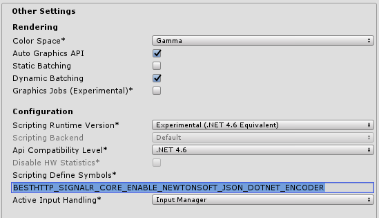
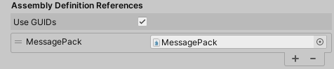
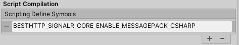
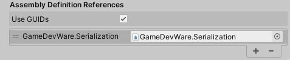
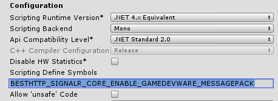

## Encoders

SignalR Core can use different encodings to send and receive messages. Current encodings are JSon and MessagePack.
Using these are not automatic, as most of these implementations require 3rd plugins and/or changes to the server.



## JSon

For the plugin, the JSon encoder is available without any additional steps. The `JsonProtocol` class is a generic implementation that can work with different encoders that can use concreate JSON parsers. The one that comes with the plugin is the `LitJsonEncoder`.
```csharp
hub = new HubConnection(new Uri("https://server/hub"), new JsonProtocol(new LitJsonEncoder()));
```

## How to Enable and Use Newtonsoft's JSON .NET For Unity Encoder

There's an encoder implementation that uses the [Newtonsoft's JSON .NET For Unity](https://assetstore.unity.com/packages/tools/input-management/json-net-for-unity-11347?aid=1101lfX8E) package.

Steps to enable it and use it:

1. Download and import the [Newtonsoft's JSON .NET For Unity](https://assetstore.unity.com/packages/tools/input-management/json-net-for-unity-11347?aid=1101lfX8E) package
2. Add the **BESTHTTP_SIGNALR_CORE_ENABLE_NEWTONSOFT_JSON_DOTNET_ENCODER** define to the [Scripting Define Symbols](https://docs.unity3d.com/Manual/PlatformDependentCompilation.html) input under **PlayerSettings/Other Settings**:

	
	
3. Use the now-available `JsonDotNetEncoder` class:
```csharp
hub = new HubConnection(new Uri("https://server/hub"), new JsonProtocol(new JsonDotNetEncoder()));
```

The `JsonDotNetEncoder` and the `LitJsonEncoder` classes can be found in the `Best HTTP\Examples\SignalRCore\Encoders\` folder.

## MessagePack-CSharp

The official SignalR Core server implementation uses [MessagePack-CSharp](https://github.com/neuecc/MessagePack-CSharp) to serialize/deserialize message on the server side. To support 

Steps to enable and useMessagePack-CSharp:

1. Follow the [instructions](https://github.com/neuecc/MessagePack-CSharp#unity) to install MessagePack-CSharp
2. Locate the BestHTTP.asmdef file under the *Best HTTP* folder
3. Add MessagePack.asmdef (located in Scripts\MessagePack\) to the list of Assembly Definition References and press Apply:

	

4. Add the **BESTHTTP_SIGNALR_CORE_ENABLE_GAMEDEVWARE_MESSAGEPACK** symbol to the [Scripting Define Symbols](https://docs.unity3d.com/Manual/PlatformDependentCompilation.html) input under **PlayerSettings/Other Settings** and press Apply:

	
	
5. The `MessagePackCSharpProtocol` class is no available, it can be used to create a new HubConnection object:

```csharp
hub = new HubConnection(new Uri("https://server/hub"), new MessagePackCSharpProtocol());
```



## GameDevWare MessagePack

By default the server has support for the JSon encoding but by [adding new packages and a few lines of code](https://docs.microsoft.com/en-us/aspnet/core/signalr/messagepackhubprotocol?view=aspnetcore-3.1) the MessagePack encoding can be enabled too.

There's a MessagePack encoding implementation for the plugin, but it's disabled by default. To enable and use it, follow these steps:

1. Download and import the [Json & MessagePack Serialization](https://assetstore.unity.com/packages/tools/network/json-messagepack-serialization-59918?aid=1101lfX8E) package
2. Create a new [Asembly Definition file](https://docs.unity3d.com/Manual/ScriptCompilationAssemblyDefinitionFiles.html) under the *Plugins\GameDevWare.Serialization* folder
3. Locate the BestHTTP.asmdef file under the *Best HTTP* folder
4. Reference the newly create asmdef file and press Apply:

	
	
5. Add the **BESTHTTP_SIGNALR_CORE_ENABLE_GAMEDEVWARE_MESSAGEPACK** define to the [Scripting Define Symbols](https://docs.unity3d.com/Manual/PlatformDependentCompilation.html) input under **PlayerSettings/Other Settings**:

	
	
6. Use the now available `MessagePackProtocol` class:
```csharp
hub = new HubConnection(new Uri("https://server/hub"), new MessagePackProtocol());
```

As you can see, the `MessagePackProtocol` uses only one class there's no MessagePackEncoder as it's very specific and uses directly the *Json & MessagePack Serialization* classes.

The `MessagePackProtocol` class can be found in the `Best HTTP\Examples\SignalRCore\Encoders\` folder.